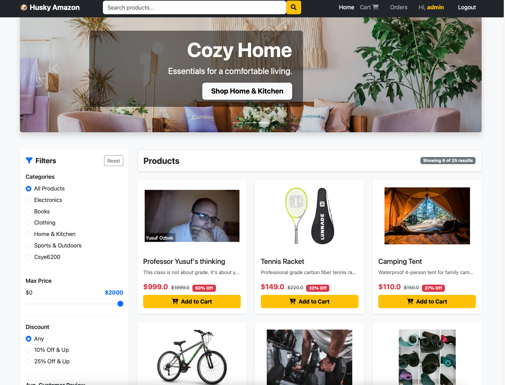
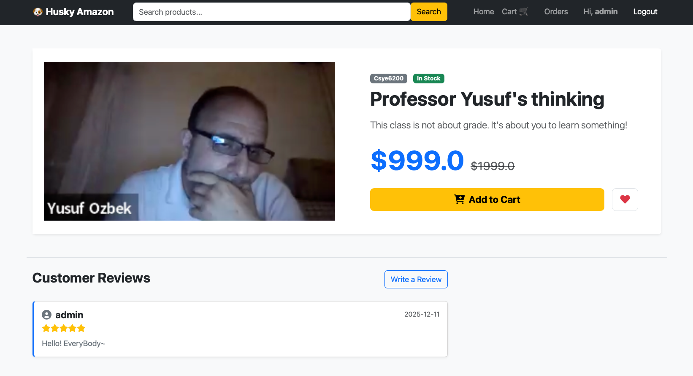
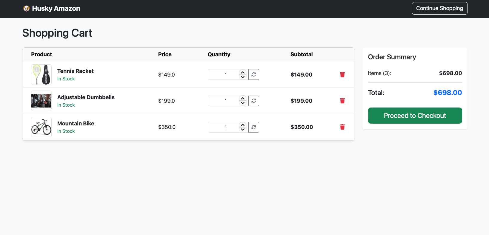
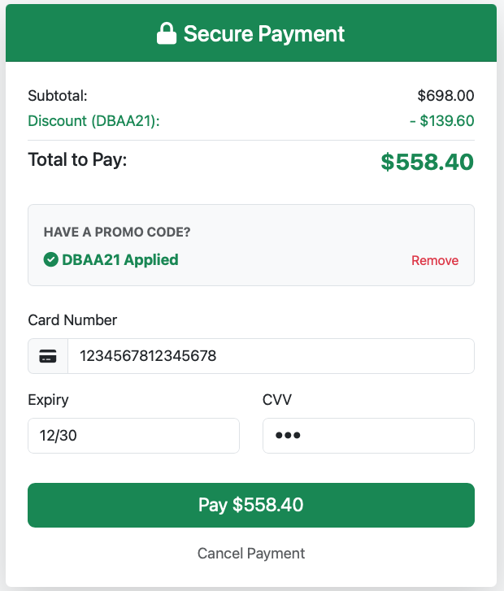
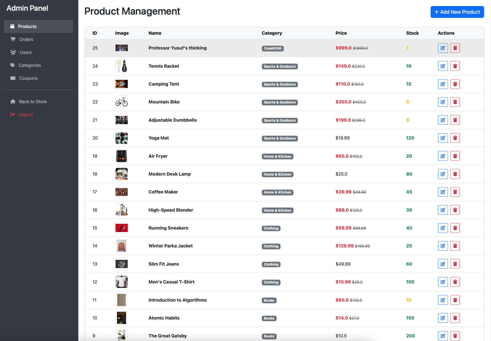
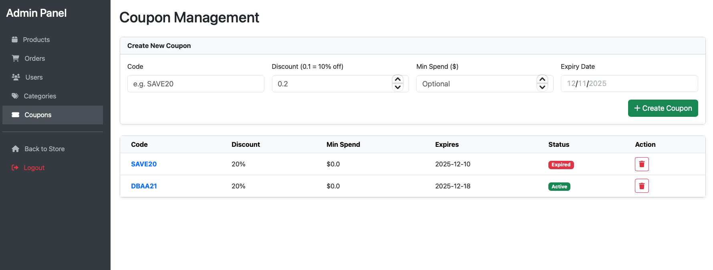

<div align="center">

# 🐶 Husky Amazon E-Commerce Platform

A full-stack e-commerce platform built with Spring Boot, featuring a complete shopping lifecycle, recommendation engine, and admin dashboard.

[View Demo](#-screenshots) • [Key Features](#-key-features) • [Tech Stack](#-tech-stack) • [Getting Started](#-getting-started)

</div>

---

## 📖 Introduction

Husky Amazon is a robust, full-stack web application designed to simulate a modern e-commerce experience. Built on the MVC architecture, it leverages Spring Boot for the backend and Thymeleaf with Bootstrap 5 for a responsive frontend UI.

Beyond basic shopping cart and order processing functionalities, this system integrates advanced features such as **Collaborative Filtering Recommendations**, a **Coupon/Promotion System**, and **Role-Based Access Control (RBAC)**, making it a production-grade practice project.

---

## ✨ Key Features

### 🛒 Client Side

- **Advanced Search & Filtering**: Filter products by keyword, price range, category, rating, and discount percentage.
- **Smart Recommendation System**: Features a "Bought Together" algorithm (Item-based Collaborative Filtering) on product detail pages.
- **Interactive Shopping Cart**: Real-time quantity updates, item removal, and dynamic total calculation.
- **Secure Checkout**: Simulated credit card payment flow with promo code (Coupon) validation and discount application.
- **User Center**: Manage personal profile, multiple shipping addresses, and view detailed order history.
- **Community Interaction**: Users can add items to their Wishlist and leave star-rated reviews.

### 🛠️ Admin Dashboard

- **Unified Dashboard**: Manage all resources via an intuitive sidebar navigation.
- **Product Management**: Full CRUD operations for products, including local image uploading and stock management.
- **Order Management**: Track order status (Placed/Shipped/Delivered) and process shipments.
- **Marketing Tools**: Create and manage coupons (set discount %, expiry dates, and minimum spend thresholds).
- **User & Category Management**: Manage product categories and system user roles/permissions.

---

## 📸 Screenshots

<div align="center">

### Home Page & Advanced Filtering
*Features a promotional carousel, sidebar filters, and a responsive product grid.*



---

### Product Detail & Recommendations
*Displays product info, customer reviews, and the "Customers who bought this also bought" recommendation section.*



---

### Shopping Cart
*Allows users to modify quantities directly with auto-recalculated totals.*



---

### Checkout & Coupon System
*Integrated promo code validation and simulated payment processing.*



---

### Admin Dashboard
*Administrators can manage products, orders, and marketing campaigns efficiently.*



---

### Admin Coupon Management
*Create and manage promotional coupons with customizable discount rates and expiry dates.*



</div>

---

## 💻 Tech Stack

| Module | Technologies |
|--------|-------------|
| **Backend** | Spring Boot 3.3, Spring MVC |
| **Persistence** | Spring Data JPA, Hibernate |
| **Database** | MySQL 8.0 |
| **Security** | Spring Security (Authentication & Authorization) |
| **Template Engine** | Thymeleaf |
| **Frontend** | Bootstrap 5, FontAwesome, CSS3 |
| **File Handling** | Standard Servlet Multipart Resolver |
| **Build Tool** | Maven |

---

## 🚀 Getting Started

### Prerequisites

- Java 17+
- MySQL 8.0+
- Maven 3.6+

### Installation Steps

#### 1️⃣ Clone the Repository
```bash
git clone https://github.com/YourUsername/HuskyAmazon.git
cd HuskyAmazon
```

#### 2️⃣ Configure Database

Create a database named `husky_amazon` in MySQL. Update `src/main/resources/application.properties`:
```properties
spring.datasource.url=jdbc:mysql://localhost:3306/husky_amazon
spring.datasource.username=root
spring.datasource.password=your_password

# Configure file upload path (Update to your local path)
file.upload-dir=/Users/YourName/Documents/HuskyUploads/
```

#### 3️⃣ Run the Application
```bash
mvn spring-boot:run
```

#### 4️⃣ Access the Application

Open your browser and navigate to: `http://localhost:8080`

**Default Admin Credentials:**
- Username: `admin`
- Password: `AdminPass123` *(Initialized via DataInitializer)*

---

## 📄 License

This project is licensed under the MIT License - see the [LICENSE](LICENSE) file for details.

---

<div align="center">

Made with ❤️ by [DBAA](https://github.com/DBAA21)

⭐ Star this repo if you find it helpful!

</div>